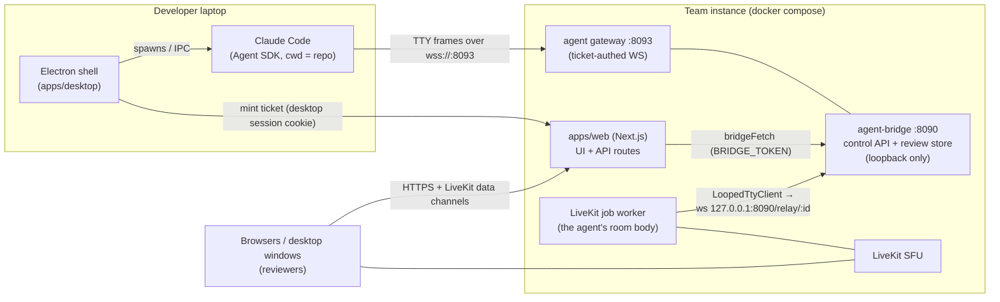

# Confidence Before Merge — v1 overview

> Review AI-generated code with the humans and agents who made it — before you merge.

This folder holds the implementation plans for LoopMeet's collaborative code-review
workflow: a review room where developers and the AI agents that authored a PR
inspect, challenge, revise, and verify code together.

**The loop we are building:** Review → Decide → Revise → Verify → Merge with confidence.

| Doc | Covers |
|---|---|
| [01-local-agent-connectivity.md](01-local-agent-connectivity.md) | How the desktop app spawns the developer's local coding agent (Claude Code) and connects it to a room |
| [02-review-surface-and-loop.md](02-review-surface-and-loop.md) | The PR review surface, concern/decision data model, and the closed review→revision→verification loop |
| [03-delivery-plan.md](03-delivery-plan.md) | PR-sized phasing across both workstreams, spikes, risks, metrics |

## Why

AI has accelerated code production faster than human confidence. Teams merge
agent-authored code they don't fully understand. LoopMeet's wedge is the moment
between code generation and merge approval: bring the PR, the relevant humans, and
the **authoring agent** (with its local context, intent, and ability to revise) into
one decision-making environment.

The authoring agent is worth inviting because it has what a fresh chat session
doesn't: intent (why this design), working state (repo, branch, tests, terminal
history), continuity (it can implement the agreed revisions), and accountability
(every concern maps to a change or an explicit decision not to change).

Core principles:

1. **Review decisions, not only diffs** — surface intent, assumptions, risk.
2. **Keep humans consequential** — agents explain and execute; humans challenge, decide, approve, own the merge.
3. **Make conversation executable** — every resolved discussion converts into a scoped revision with traceable proof.

## V1 scope decisions (settled)

- **Thin closed loop, end to end.** Every step of the loop ships, minimally polished:
  PR import → interrogation → concern/decision capture → revision handoff → agent
  revises the branch → verification against the original concerns. Depth comes later.
- **The desktop Electron app spawns and manages the local authoring agent.**
  Claude Code first (via the Claude Agent SDK against the user's own installed
  `claude` binary). Codex/OpenCode are follow-ups behind the same adapter seam.
- **The local agent supplies PR data via its own `git`/`gh` credentials.** No
  server-side GitHub integration in v1: no octokit, no GitHub App, no server-held
  tokens. The agent pushes a PR snapshot into the room and writes summaries back to
  GitHub itself. This keeps self-hosted instances zero-config and honors the
  brain-first architecture (all capability lives behind the agent seam).
- **Web participants are first-class reviewers.** They view the diff, raise
  concerns, decide, and verify. Only *hosting* an agent requires the desktop app.
- **Text-first agent presence.** The local agent joins as a text participant
  (chat + review ops + activity feed). Voice presence is a later mode flip on the
  same connection, not a redesign.

## Architecture in one picture

The two workstreams compose at exactly one seam: the review workflow (02) talks to
the agent through **ordinary brain turns and `<<<REVIEW … REVIEW>>>` marker blocks**,
which the connectivity transport (01) carries verbatim as TTY frames. Neither
workstream needs the other's internals; they can be built in parallel after the
shared contracts land.

What stays untouched — deliberately:

- `apps/agent-bridge/src/looped-tty.ts` — the brain abstraction. The desktop speaks
  its existing frame protocol over a reversed (outbound-from-laptop) socket.
- The brain-first split: the bridge remains eyes/ears/mouth; all intelligence,
  tools, credentials, and permissions live on the laptop behind the agent seam.
- GitHub's merge controls: LoopMeet records decisions and writes summaries back;
  approval and merge remain human actions in GitHub's model.

## North-star behavior and metrics

> A team brings a real pull request, resolves a real concern, and asks to do it again.

Instrument from day one (PostHog is already wired in `apps/web`):

- % of review rooms producing ≥1 explicit decision
- % of decisions converted into agent revisions
- % of concerns verified as resolved
- Time from review start to merge decision
- Repeat usage by the same team within 30 days

## Deferred (explicitly not v1)

- Voice presence for the local agent (mode flip on the same connection)
- Postgres review history / cross-session concern re-import (schema designed in 02)
- Codex / OpenCode runners (adapter seam defined in 01)
- Server-side GitHub integration (App or instance token) and in-app merge button
- Realtime-model native review tools (`read_review` etc. — brains see review state via meeting context)
- Multiplexed persistent daemon socket (one WS per room/user in v1)
- Comment threads (replies) on concerns; automatic anchor remapping across pushes
- Multi-PR per room

## Relationship to docs/ROADMAP.md

This direction supersedes parts of the written roadmap (which placed "agent
workflows" in Phase 4 / the agent-framework repo). Reconciling ROADMAP.md is a
separate, deliberate edit — these plans are additive and do not modify it.
