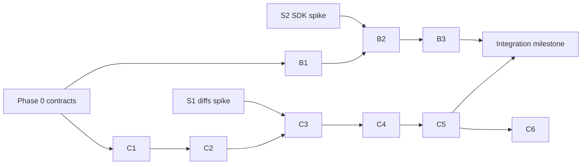

# Workstream 03 — Delivery plan

PR-sized sequencing across [01 (connectivity)](01-local-agent-connectivity.md) and
[02 (review surface & loop)](02-review-surface-and-loop.md), spikes, risks, and how
v1 maps back to the strategy brief.

## Spikes (run first, in parallel — both are gates)

**S1 — `@pierre/diffs` probe** (gates C3/C4).
Scratch Next.js page or storybook-style harness: feed it a real per-file unified
patch from an actual PR (`gh pr diff`). Verify: input format (patch string vs
structured hunks vs before/after contents), the annotation API (inject a React
component at a line), line-selection events, shiki configuration (language subset,
lazy grammars), shadow-DOM theming against daisyUI tokens, SSR behavior under
`next/dynamic({ssr:false})`, and measured bundle contribution. Output: a short
findings note appended to plan 02 + go/no-go on the library.

**S2 — Agent SDK ↔ TTY mapping smoke test** (gates B-phases).
Node script (no Electron): drive `@anthropic-ai/claude-agent-sdk` against the
locally installed `claude` binary in a scratch repo; map its event stream to TTY
frames per the table in plan 01 §3; confirm `interrupt()`, `resume`, `canUseTool`
prompting, and a `gh pr view` call inheriting user credentials. Output: validated
`frames.js` mapping + any SDK surprises noted in plan 01.

## Phases

Each phase is one reviewable PR (or a small stack). The two workstreams interleave;
A/B and C tracks can proceed in parallel after Phase 0.

**Phase 0 — Shared contracts** *(one PR, blocks everything)*
- `packages/shared/src/review.ts` + tests + subpath export.
- `packages/shared/src/index.ts`: `DataTopic.Review`, `reviewSyncMessageSchema`,
  `participantsCanResolveReviews`.
- `packages/shared/src/protocol.ts`: optional `capabilities?: string[]` +
  handshake test updates; `/api/health` advertisement wiring.

**Track B — connectivity (plan 01)**

- **B1 — Agent gateway + relay.** `agent-gateway.ts`, relay upgrade on :8090, mint
  route `POST /rooms/:room/local-agents`, worker `local-` branch + `mode:"text"` +
  `turnTimeoutMs` passthrough, compose port, `AGENT_GATEWAY_PUBLIC_URL`.
  Testable without Electron: a Node script dials the gateway with a ticket and
  answers turns — the agent appears in a room and chats.
- **B2 — Desktop runtime.** `workspace-preload.js`, IPC surface, `manager.js`,
  `claude-runner.js` (from S2), `gateway-client.js`, `frames.js`, consent +
  permission dialogs, navigation guard, lifecycle cleanup, `check-protocol-sync.mjs`.
- **B3 — Web connect UX.** `meet-shell.d.ts`, AgentsPanel "Connect my coding
  agent" section, capability gating, degradation hint, status surface.

**Track C — review surface & loop (plan 02)**

- **C1 — Bridge store & routes.** `review-store.ts` (op applier + authorization
  table + caps + TTL) + tests; mount in `index.ts`; the three web proxy routes.
- **C2 — Agent push path.** `review-blocks.ts`, worker block extraction +
  `review-sync` broadcast + Review topic in `onData`, `meeting-context.ts` review
  section. Testable with any TTY brain (e.g. the demo agent) before B lands.
- **C3 — Read-only viewer.** `@pierre/diffs` integration (from S1), `stores/review.ts`,
  `ReviewTakeover`/`ReviewFileTree`/`ReviewDiffFile` behind `next/dynamic`,
  panels/ControlBar/MeetingView/RoomDataListener wiring.
  **← The demo moment: agent loads a PR, everyone sees the diff live.**
- **C4 — Concerns & decisions.** Line-select → `NewConcernPopover`, `ConcernThread`
  annotations, `ReviewPanel` ledger + decide, agent-proposed concerns (adopt/discard).
- **C5 — Closed loop.** Compose/dispatch sheet, worker dispatch handling + revision
  turn envelope, progress timeline, `revision-result` + snapshot refresh + stale
  anchors, verify ✓/✗, failure/retry, agent-offline banner.
- **C6 — Polish (v1-worthy, individually cuttable).** `pr-list` picker,
  `review-focus` follow-presenter, GitHub summary write-back action, toasts,
  PostHog events for the metrics below.

**Integration milestone — the full loop on a real PR** *(after B3 + C5)*
Two humans (one desktop, one web) + the desktop-spawned Claude Code review a real
agent-authored PR: load → concern → decide → dispatch → revise → verify → summary
posted to GitHub. Record the session; this is the Experiment 3/4 artifact.

## Dependencies at a glance

C1–C5 are exercisable with the existing demo TTY agent before the desktop path
exists — the marker-block protocol doesn't care where the brain runs. This keeps
the tracks genuinely parallel.

## Risks (consolidated)

| Risk | Mitigation | Phase |
|---|---|---|
| `@pierre/diffs` API doesn't fit | S1 gate; fallback: hand-rolled unified diff renderer — library is a leaf | S1 |
| Gateway TLS burden for self-hosters | Reverse-proxy stanza in selfhost.md; fallback: route gateway path through the existing :3000 proxy | B1 |
| SDK packaging in electron-builder (asarUnpack) | S2 + user's own binary as primary path | B2 |
| Marker-block JSON fragility | Legible error feedback to the brain (mirror canvas-blocks) | C2 |
| Huge PRs blow caps/DOM | 500-file/256K/4MB caps + truncation flags + accordion mount; tune on real PRs | C3 |
| Bridge restart loses ledger mid-review | Accepted v1 (agent re-pushes; GitHub summary durable); Postgres phase 2 | — |
| Long revisions exceed turn timeout | `turnTimeoutMs` 30 min; progress-keepalive later | B1/C5 |

## Open questions (decide during build, owner: product)

- Per-user cap of one local agent per room — recommended yes (enforced at mint).
- `verify` by the concern's raiser allowed? — recommended yes for v1 (small teams).
- Auto-open the stage for everyone on `push-snapshot`, or toast-only? — start
  toast-only + auto for the requester; revisit after first sessions.

## Mapping to the strategy brief

- **Experiment 3 (clickable closed-loop prototype)** = C3→C5 on a real PR with the
  team's own agent. Pass signal: users complete the loop unprompted and ask to run
  another PR.
- **Experiment 4 (thin pilot)** = the integration milestone shipped to 3–5 design-
  partner teams (self-hosted or hosted instances).
- **North-star metrics** (instrument in C6 via existing PostHog):
  rooms with ≥1 decision · decisions → revisions rate · concerns verified rate ·
  review-start → merge-decision time · repeat team usage in 30 days · "would the
  review have been worse without the authoring agent present?" (session-end prompt).

## Definition of done for v1

1. A desktop user connects their Claude Code to a room in under a minute, with
   explicit consent and no credential handoff to the server.
2. The agent loads a real PR; every participant (web included) reads the diff.
3. A concern raised on a line becomes a decision, a dispatched revision, new
   commits on the branch, and a verified resolution — all traceable in the ledger.
4. The review summary lands on the GitHub PR via the agent.
5. Losing the agent mid-review never loses the ledger or blocks human actions.
6. Old desktop builds against new servers (and vice versa) degrade gracefully via
   the capabilities handshake.
